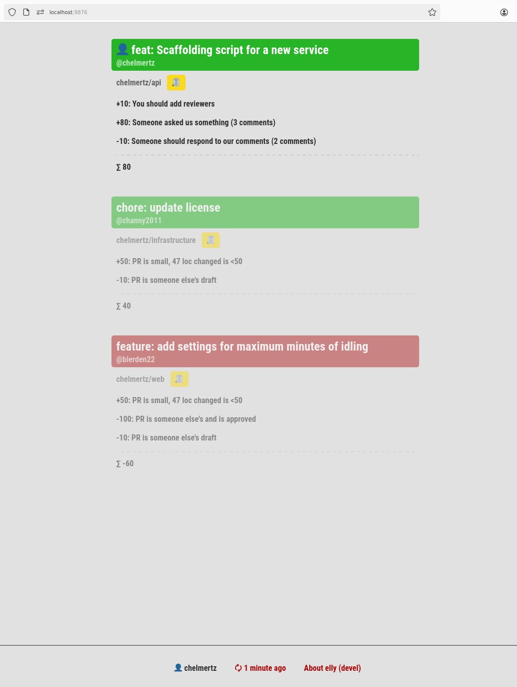
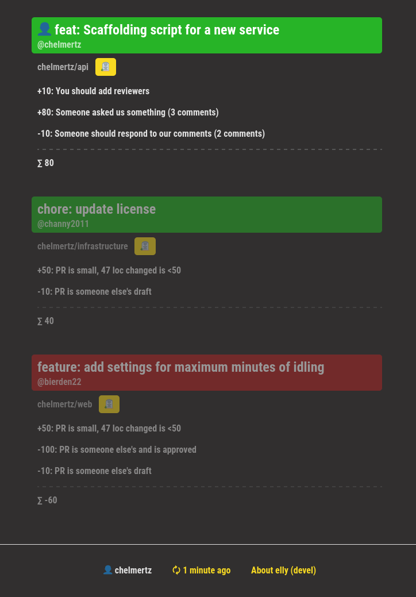
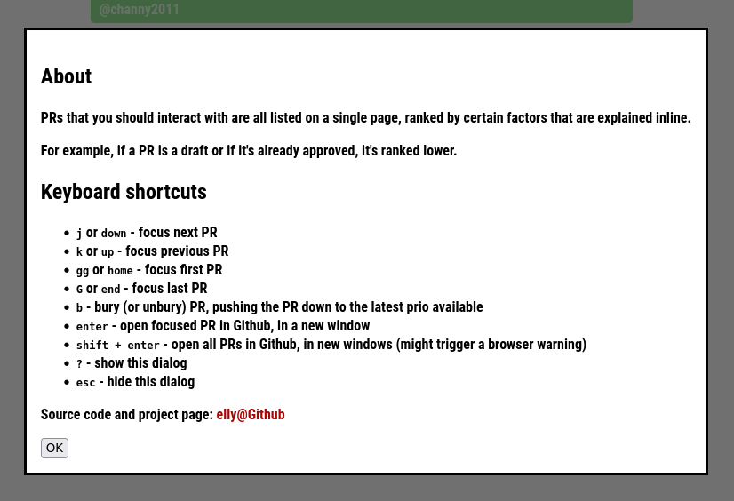
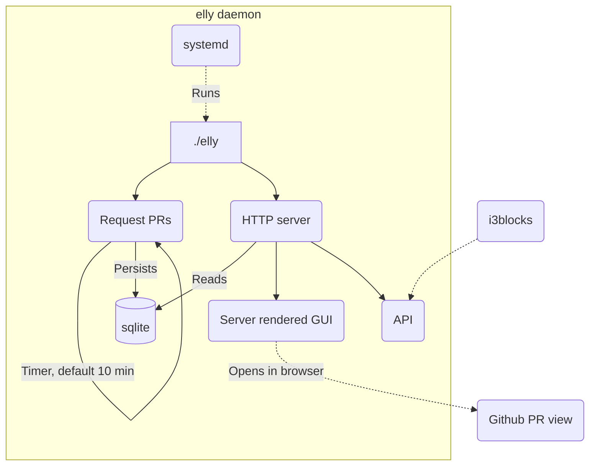

# elly

Github pull requests presented in a prioritized order, via a keyboard driven web
GUI & API.

Requires a Github PAT (personal access token). Configure it through the web UI
settings, or pass it via the `GITHUB_PAT` environment variable. elly should be hosted
locally.








```mermaid
flowchart TB
    subgraph elly daemon
    A[./elly] --> B(Request PRs)
    H(systemd) -.->|Runs| A
    B -->|Timer, default 10 min| B
    F[(sqlite)]
    B -->|Persists|F
    A --> C(HTTP server)
    C -->|Reads| F
    C --> D(Server rendered GUI)
    C --> E(API)
    end
    D -.->|Opens in browser| G(Github PR view)
    I(i3blocks) -.-> E
```

## PAT Oauth permissions

Two token classes work, and they differ in exactly one thing: whether elly can
name a failing Github Actions job.

### Fine-grained (recommended, read-only)

A **fine-grained** token (`github_pat_…`, created at
<https://github.com/settings/personal-access-tokens>) with these _repository_
permissions:

- commit status (read only)
- contents (read only)
- metadata (read only)
- pull requests (read only)

Also:

- allow the token access to "all repositories"
- adjust the "resource owner" to your personal or your workplace's organisation
- set a proper expiration date

**A fine-grained token cannot name a failing Github Actions job.** Github
restricts the _checks_ permission to Github Apps and does not offer it in the
fine-grained token UI at all, so there is nothing to grant. A pull request's
checks arrive as two types: Github Actions jobs are `CheckRun` and need
_checks_, while everything reported from outside Github - buildkite, jenkins,
sonarcloud - is `StatusContext` and is covered by _commit status_. The overall
red/green verdict is an aggregate Github computes for you and stays correct
either way; what disappears is the name of the Actions job that failed, and it
disappears silently, as nulls rather than as an error. Elly notices and says so
on its own page rather than showing you an empty list.

### Classic (names the Actions jobs, much broader)

A **classic** token (`ghp_…`, <https://github.com/settings/tokens>) with the
`repo` scope reads `CheckRun` and so gets the names. The cost is that `repo` is
read _and write_ on every repository you can reach, where the fine-grained
token above is read-only on four things. Authorise it for any SSO organisation
you need, and note that an organisation can forbid classic tokens outright.

Pick the fine-grained one unless the names of failing Actions jobs are worth
that blast radius.

## Installation


### Go package

```shell
go install github.com/chelmertz/elly@latest
```

will fetch you the latest binary. See contrib/elly.service for a systemd
example of managing the service.

### Docker

```shell { name=docker }
docker run -d \
  --name elly \
  --restart unless-stopped \
  -v elly-data:/data \
  -p 9876:9876 \
  ghcr.io/chelmertz/elly:latest
```

If you have `gh` CLI installed and authenticated, you can use `$(gh auth
token)` instead of a PAT you stashed away somewhere:

This creates a named volume `elly-data` for the SQLite database (Docker manages it automatically).

The `--restart unless-stopped` flag ensures elly starts automatically on boot.

**Useful commands:**

```shell
docker logs -f elly                             # View logs
docker stop elly                                # Stop
docker rm elly                                  # Remove
docker pull ghcr.io/chelmertz/elly:latest       # Update image
```

### Nix

Run directly: `nix run github:chelmertz/elly`

Or, install permanently:

- Add the flake to your system configuration
- Or: `nix profile install github:chelmertz/elly`

## Developing

See [dev.md](dev.md) for some useful commands during development.

## Design decisions

See [decisions/](decisions/) for ADRs.
