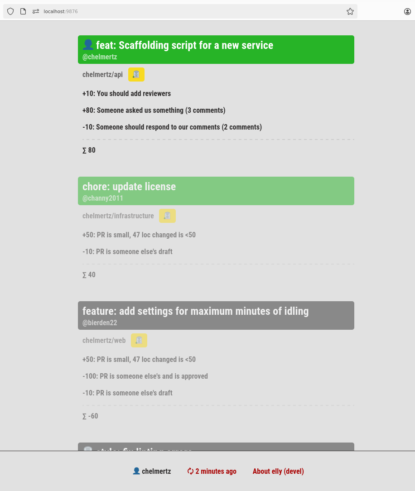

# elly

Github pull requests presented in a prioritized order, via a keyboard driven web
GUI & API.

Configured by a Github PAT (personal access token), using the env var
`GITHUB_PAT`. Should be hosted locally.





## PAT Oauth permissions

A Github personal access token these _repository_ permissions:

- commit status (read only)
- contents (read only)
- metadata (read only)
- pull requests (read only)

Don't forget to also:

- allow the token access to "all repositories"
- adjust the "resource owner" to your personal or your workplace's organisation
- set a proper expiration date

## Installation

```
go install github.com/chelmertz/elly@latest
```
will fetch you the latest binary. See contrib/elly.service for a systemd
example of managing the service.

## Design decisions

See `/decisions` for ADRs.

## Developing

With a .env file containing something like:

```
export GITHUB_PATH=github_pat_123k135hjhhjtjethwejhtjh5jhj
```

```sh
find . | grep -E 'html|go' | entr -r -s 'source .env && go run .'
```
