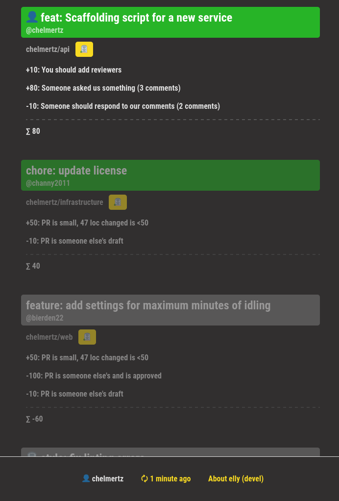

# elly

Github pull requests presented in a prioritized order, via a keyboard driven web
GUI & API.

Requires a Github PAT (personal access token). Configure it through the web UI
settings, or pass it via the `GITHUB_PAT` environment variable. elly should be hosted
locally.





## PAT Oauth permissions

A Github personal access token these _repository_ permissions:

- commit status (read only)
- contents (read only)
- metadata (read only)
- pull requests (read only)

Don't forget to also:

- allow the token access to "all repositories"
- adjust the "resource owner" to your personal or your workplace's organisation
- set a proper expiration date

## Installation


### Go package

```shell
go install github.com/chelmertz/elly@latest
```

will fetch you the latest binary. See contrib/elly.service for a systemd
example of managing the service.

### Docker

```shell { name=docker }
docker run -d \
  --name elly \
  --restart unless-stopped \
  -v elly-data:/data \
  -p 9876:9876 \
  ghcr.io/chelmertz/elly:latest
```

If you have `gh` CLI installed and authenticated, you can use `$(gh auth
token)` instead of a PAT you stashed away somewhere:

This creates a named volume `elly-data` for the SQLite database (Docker manages it automatically).

The `--restart unless-stopped` flag ensures elly starts automatically on boot.

**Useful commands:**

```shell
docker logs -f elly                             # View logs
docker stop elly                                # Stop
docker rm elly                                  # Remove
docker pull ghcr.io/chelmertz/elly:latest       # Update image
```

### Nix

Run directly: `nix run github:chelmertz/elly`

Or, install permanently:

- Add the flake to your system configuration
- Or: `nix profile install github:chelmertz/elly`

## Developing

See [dev.md](dev.md) for some useful commands during development.

## Design decisions

See [decisions/](decisions/) for ADRs.
